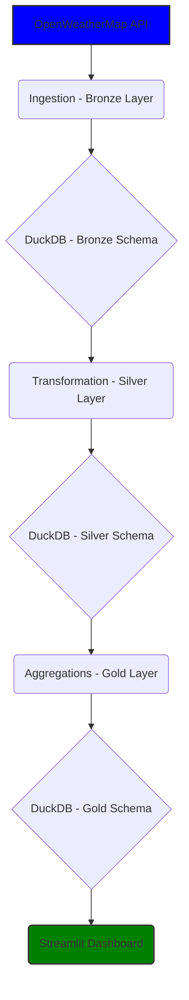

# Weather Insights Project

This project is all about gathering, organizing, and understanding weather data to offer insights. We pull in live weather information from the OpenWeatherMap API, process it, and present it in a way that's easy to grasp.  This is a personal project with the purpose of learning about building a end-to-end data project using DuckDb and Streamlit.


## [Project Demo](https://amitcs-weather-app.streamlit.app/)

[](https://github.com/amitchannagiri/weather-app/blob/main/weather-pipeline/data/streamlit-app-demo.webm)

## What We Do

The project takes in raw weather data and transforms it into a user-friendly format.

1.  **Gathering:** collect the initial, untouched weather data straight from the source.
2.  **Cleaning & Shaping:** tidy up the data, correct any issues, and organize it so it's easier to work with.
3.  **Summarizing:** create summaries and overviews of the data to make it easy to understand.
4.  **Showing:** display the insights in a visually engaging way through an interactive dashboard.

## How It Works

The system is a pipeline, flowing through different stages:

*   **Bronze Layer (Raw Data):** This is where the fresh, unprocessed data from the weather API lives.
*   **Silver Layer (Cleaned Data):** Here, the raw data is cleaned, organized, and structured for analysis.
*   **Gold Layer (Insightful Data):** This is where we create summaries, trends, and insights from the cleaned data. These are the insights presented.

## Getting Started

Want to check out the weather insights? Here's how:

1.  **Create an environment**: Create an isolated area for the project.
    ```bash
    python -m venv venv
    source venv/Scripts/activate  # On Mac/Linux
    venv\Scripts\activate # On Windows
    ```

2.  **Install the needed software**: Get all the necessary tools.
    ```bash
    pip install -r requirements.txt
    ```

3.  **API Key**: You'll need to get a free API key from OpenWeatherMap and add it to the Github secrets and pass it through the command line.
    - Add your API key into the Github secrets

4.  **Run:** Start the data pipeline to process the data.
    ```bash
    python src/main.py
    ```

5. **Serve the insights**: Display the data
     ```bash
    python3 -m streamlit run src/visualization/app.py
    ```

## Behind the Scenes - Technical Information

This section is for those who want to know the "how" behind the project.

### Architecture Diagram


### Tools and Technologies
**Data Source:**
OpenWeatherMap API: Provides live weather data in JSON format.

**Data Storage:**
DuckDB: A high-performance, in-process analytical database used to store the raw, cleaned, and summarized weather data. We use the following schema:

    * Bronze
    * Silver
    * Gold

**Data Processing:**
Python: The primary programming language for the entire data pipeline.
Custom scripts: For reading from the API and then inserting into DuckDb
SQL: DuckDb makes the use of SQL an option for all data transformations.

**Data Visualization:**
Streamlit: A Python framework used to create the interactive dashboard that displays the weather insights.

**CI/CD**
Github Actions: Schedule actions to refresh the data.

**Other:**
Virtual Environment (venv): For managing project dependencies in isolation.
dotenv: For managing environment variables.
requirements.txt: For tracking project dependencies.

## Project Structure

```
weather-pipeline/
├── src/
│   ├── config/           
│   ├── ingestion/        
│   ├── processing/       
│   ├── storage/          
│   ├── utils/           
│   └── visualization/    
└── tests/                            
```
## Future Improvements

* Adding more cities.
* Add more types of charts.
* Add error management and alerting.
